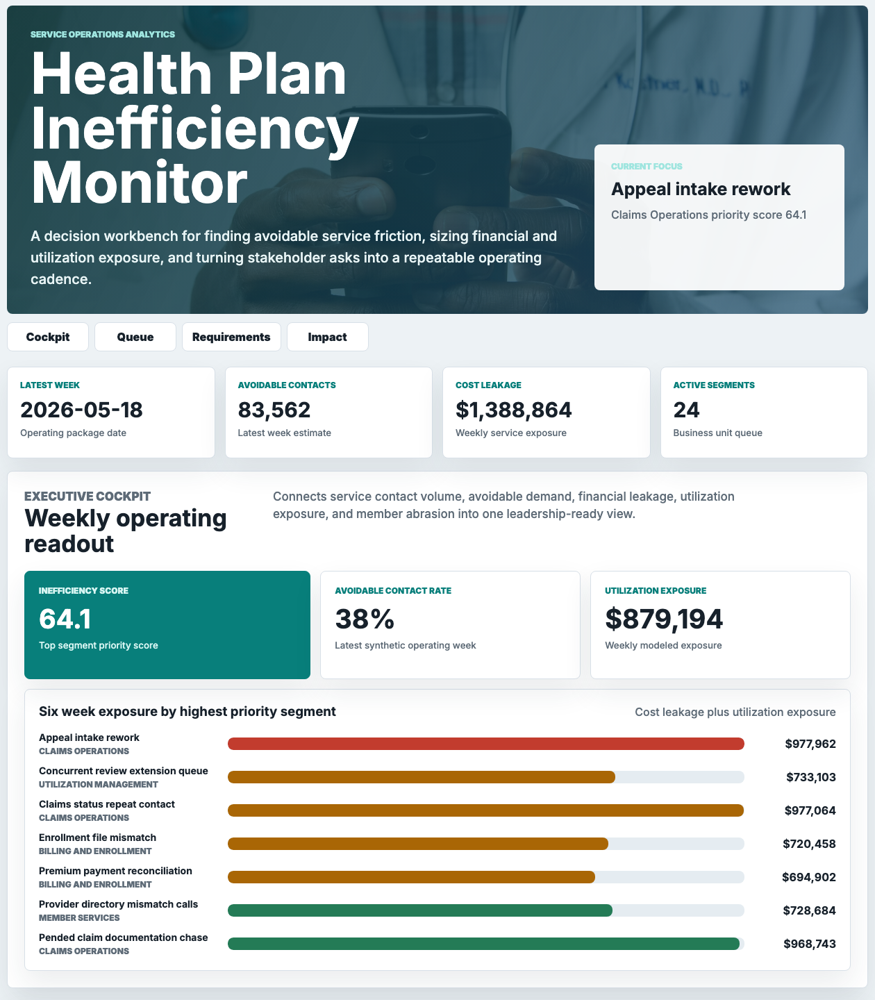
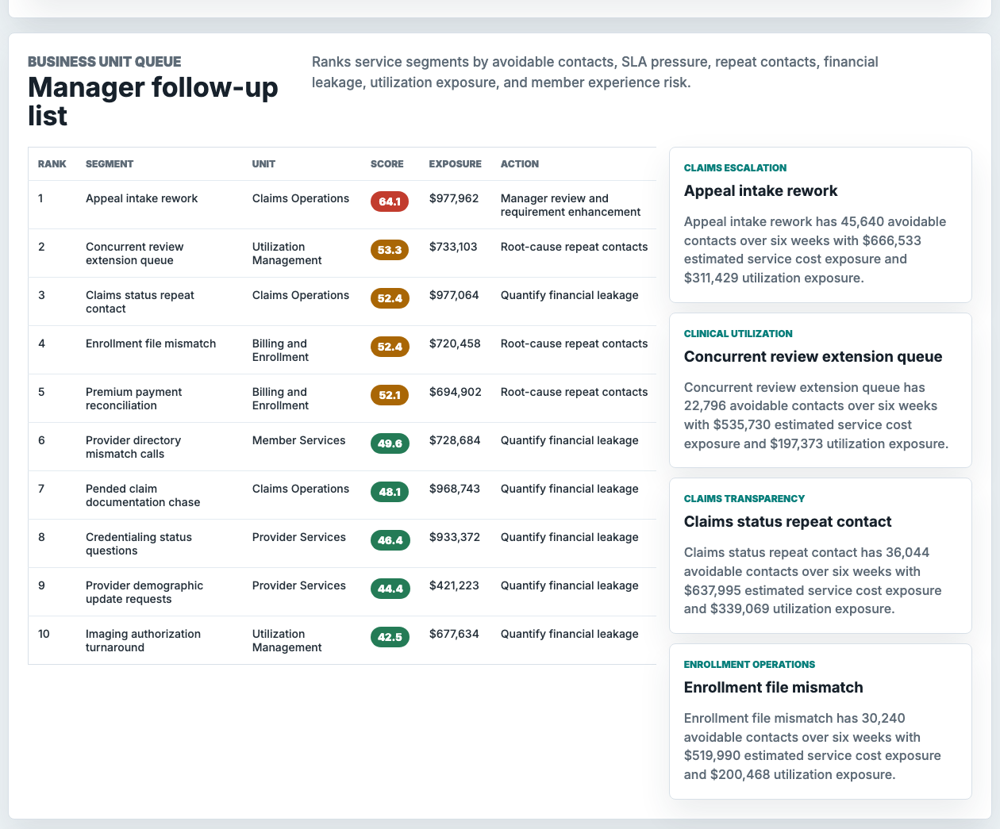
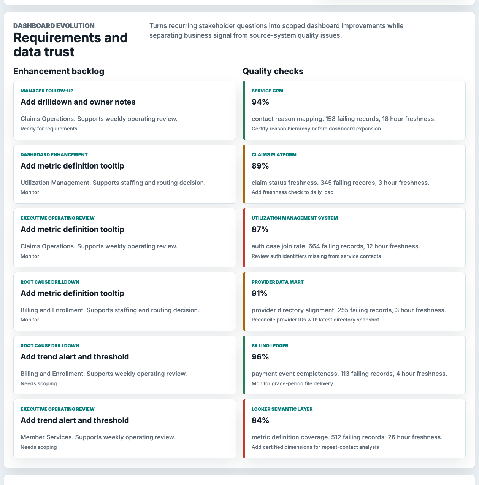
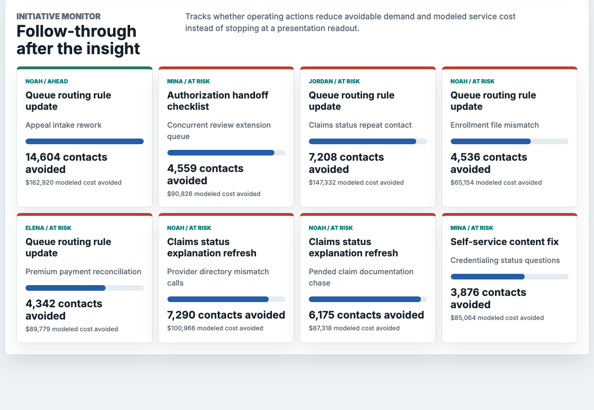

# Health Plan Service Ops Inefficiency Monitor

An interactive portfolio artifact for a technology-enabled health insurer that needs to identify service operations inefficiencies before they become recurring cost, utilization, and member experience problems.

The workbench connects synthetic service contacts, claims friction, utilization management handoffs, provider support issues, billing operations, data quality checks, dashboard enhancement requests, and initiative outcomes into one operating cadence for managers and senior managers.

## What this project shows

- A weekly executive cockpit that translates service volume, avoidable contacts, cost leakage, utilization exposure, and member abrasion into a clear operating readout.
- A ranked business-unit queue that identifies which service segments need manager follow-up first.
- A dashboard requirements backlog that turns repeated stakeholder questions into scoped reporting improvements.
- A data trust surface that separates true business signal from source-system quality issues.
- An initiative monitor that tracks whether actions reduce avoidable contacts and modeled service cost.

## Screenshots



Executive cockpit, showing the top service operations priority, latest avoidable-contact rate, modeled cost leakage, utilization exposure, and the highest exposure segments.



Manager follow-up queue, showing ranked service segments with business unit, inefficiency score, combined exposure, recommended action, and leadership-ready notes.



Requirements and data trust surface, showing how stakeholder asks become dashboard enhancements while source checks determine whether metrics are ready for recurring reporting.



Initiative monitor, showing whether follow-up actions are reducing avoidable demand and modeled cost after the analysis is presented.

## Data strategy

Internal health plan service operations data is not public, so this project uses deterministic synthetic data. The generator can be rerun with:

```bash
python3 scripts/score_operating_data.py
```

The synthetic data is modeled on normal health plan service operations structures:

- 24 service segments across member services, claims operations, utilization management, provider services, billing and enrollment, pharmacy operations, care navigation, and risk adjustment support.
- 20 weeks of segment-level operating metrics, including contact volume, avoidable contact rate, repeat contact rate, SLA attainment, handle time, pended claims, authorization turnaround, member abrasion, cost leakage, and utilization exposure.
- Dashboard enhancement requests from senior managers, associate directors, operations managers, and analytics leads.
- Source-system quality checks across service CRM, claims, utilization management, provider data, billing, and semantic-layer reporting.
- Initiative monitoring that estimates contacts avoided and cost avoided against target reductions.

All generated values are synthetic and do not represent real company, member, provider, claim, utilization, or financial performance.

## Analysis artifacts

- [analysis/analysis_plan.md](analysis/analysis_plan.md)
- [analysis/executive_findings.md](analysis/executive_findings.md)
- [analysis/sql_checks.sql](analysis/sql_checks.sql)
- [analysis/outputs/priority_queue.csv](analysis/outputs/priority_queue.csv)
- [analysis/outputs/summary.json](analysis/outputs/summary.json)
- [data_dictionary.md](data_dictionary.md)

## Role alignment

This artifact demonstrates the work expected from a service operations data analytics associate:

- Scope an ambiguous operations problem into measurable business questions.
- Use SQL-style logic to filter, aggregate, and rank large operational datasets.
- Build a transparent model that identifies healthcare inefficiencies and supports follow-up.
- Package findings for non-technical stakeholders in a concise leadership-ready format.
- Define dashboard enhancements as user needs evolve.
- Monitor whether recommended actions improve financial, utilization, and operating outcomes.

## Scope

This is a static portfolio artifact with reproducible synthetic data and transparent scoring. It does not connect to live claims systems, service CRMs, utilization management platforms, provider directories, billing systems, member records, BI tools, spreadsheets, or data warehouses. It does not claim to represent real performance. It shows a defensible workflow for service operations analytics, stakeholder follow-up, dashboard evolution, data quality review, and initiative impact monitoring.

## Run locally

```bash
npm run start
```

Then open `http://127.0.0.1:4173`.
